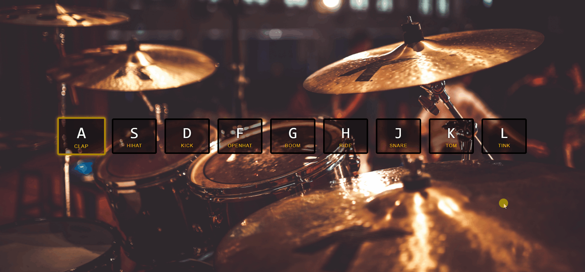

# Drum Kit 🥁

A Virtual Drum is a hub, where you can play beats for drums with virtual drum kit by pressing `ASDFGHJKL` keys or by clicking it.

###### Using for portfolio purpose :link:[Sahil Awasthi](https://linktr.ee/sahilawasthi)
